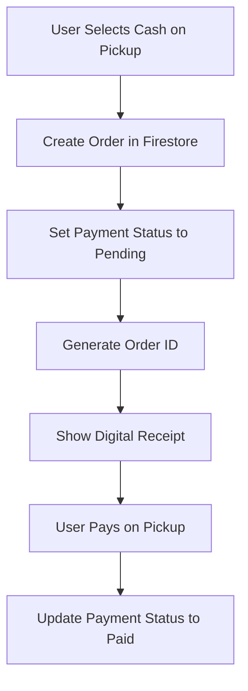
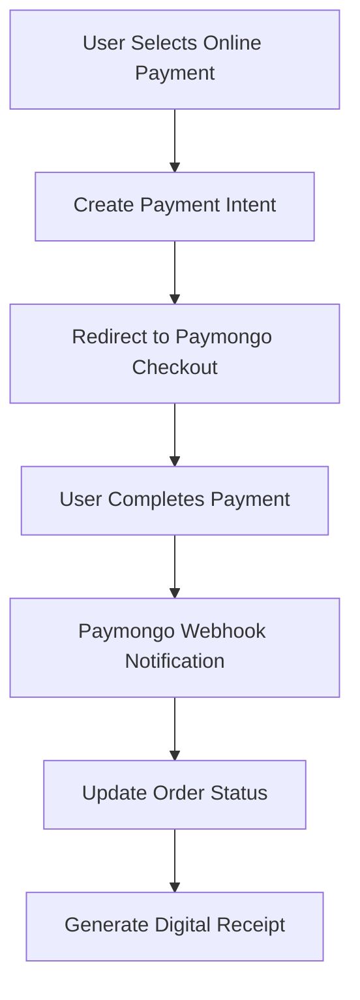

# Payment System Implementation

## Overview

The Payment System provides a comprehensive solution for processing payments in the VegieConnect marketplace. It supports both offline (Cash on Pickup) and online payment methods (GCash, PayMaya) with seamless integration to Paymongo API for secure online transactions.

## Features

### 💳 **Payment Methods**
- **Cash on Pickup**: Traditional payment method for local transactions
- **GCash**: Digital wallet payment through Paymongo integration
- **PayMaya**: Digital payment platform integration

### 🔒 **Security & Compliance**
- **Paymongo API Integration**: Secure payment processing
- **PCI DSS Compliance**: Industry-standard security
- **Encrypted Transactions**: All payment data is encrypted
- **Fraud Protection**: Built-in fraud detection mechanisms

### 📊 **Payment Tracking**
- **Real-time Status**: Track payment status in real-time
- **Payment History**: Complete transaction history
- **Order Integration**: Seamless order-payment linkage
- **Receipt Generation**: Digital receipts for all transactions

## Architecture

### **Payment Service (`payment_service.dart`)**

```dart
class PaymentService {
  // Paymongo API Configuration
  static const String _baseUrl = 'https://api.paymongo.com/v1';
  static const String _secretKey = 'sk_test_'; // Your Paymongo secret key
  static const String _publicKey = 'pk_test_'; // Your Paymongo public key

  // Payment methods
  static const Map<String, String> _paymentMethods = {
    'cash_on_pickup': 'Cash on Pickup',
    'gcash': 'GCash',
    'paymaya': 'PayMaya',
  };
}
```

### **Core Functions**

#### **1. Payment Intent Creation**
```dart
Future<Map<String, dynamic>> createPaymentIntent({
  required double amount,
  required String currency,
  required String paymentMethod,
  required String orderId,
  Map<String, dynamic>? metadata,
})
```

#### **2. Payment Processing**
```dart
Future<Map<String, dynamic>> processPayment({
  required String paymentIntentId,
  required String paymentMethodId,
  required String orderId,
})
```

#### **3. Cash on Pickup Processing**
```dart
Future<Map<String, dynamic>> processCashOnPickup({
  required String orderId,
  required double amount,
})
```

#### **4. GCash Source Creation**
```dart
Future<Map<String, dynamic>> createGCashSource({
  required double amount,
  required String currency,
  required String orderId,
})
```

## Database Schema

### **Orders Collection**
```json
{
  "buyerId": "string",
  "productId": "string",
  "sellerId": "string",
  "productName": "string",
  "quantity": "number",
  "unit": "string",
  "price": "number",
  "status": "string", // 'pending', 'processing', 'completed', 'cancelled'
  "paymentMethod": "string", // 'cash_on_pickup', 'gcash', 'paymaya'
  "paymentStatus": "string", // 'pending', 'unpaid', 'paid', 'failed', 'refunded'
  "paymentAmount": "number",
  "paymentDate": "timestamp",
  "orderId": "string",
  "totalAmount": "number",
  "createdAt": "timestamp",
  "updatedAt": "timestamp"
}
```

### **Payment Transactions Collection**
```json
{
  "orderId": "string",
  "paymentIntentId": "string",
  "paymentMethod": "string",
  "amount": "number",
  "currency": "string",
  "status": "string",
  "metadata": "object",
  "createdAt": "timestamp",
  "updatedAt": "timestamp"
}
```

## User Interface

### **Checkout Summary Page**

#### **Payment Method Selection**
- **Visual Icons**: Each payment method has a distinct icon
- **Method Descriptions**: Clear descriptions of each payment type
- **Online/Offline Indicators**: Visual distinction between payment types
- **Interactive Selection**: Easy-to-use radio button interface

#### **Payment Processing Flow**
1. **Select Payment Method**: User chooses from available options
2. **Review Order**: Display order summary with selected payment method
3. **Process Payment**: Handle payment based on selected method
4. **Confirmation**: Show success/failure status
5. **Receipt Generation**: Generate digital receipt

### **Digital Receipt Page**

#### **Enhanced Receipt Features**
- **Order Details**: Complete order information
- **Payment Summary**: Detailed payment breakdown
- **Payment Method**: Clear display of chosen payment method
- **Next Steps**: Guidance for post-purchase actions
- **Action Buttons**: Continue shopping or track order

## Payment Flow

### **Cash on Pickup Flow**



### **Online Payment Flow (GCash/PayMaya)**



## Paymongo Integration

### **API Configuration**

#### **Environment Setup**
```dart
// Development
static const String _secretKey = 'sk_test_...';
static const String _publicKey = 'pk_test_...';

// Production
static const String _secretKey = 'sk_live_...';
static const String _publicKey = 'pk_live_...';
```

#### **Payment Intent Creation**
```dart
final response = await http.post(
  Uri.parse('$_baseUrl/payment_intents'),
  headers: {
    'Authorization': 'Basic ${base64Encode(utf8.encode('$_secretKey:'))}',
    'Content-Type': 'application/json',
  },
  body: jsonEncode({
    'data': {
      'attributes': {
        'amount': (amount * 100).round(), // Convert to centavos
        'currency': currency,
        'payment_method_allowed': [paymentMethod],
        'description': 'Order #$orderId',
        'metadata': {
          'order_id': orderId,
          ...?metadata,
        },
      },
    },
  }),
);
```

#### **Payment Processing**
```dart
final response = await http.post(
  Uri.parse('$_baseUrl/payment_intents/$paymentIntentId/attach'),
  headers: {
    'Authorization': 'Basic ${base64Encode(utf8.encode('$_secretKey:'))}',
    'Content-Type': 'application/json',
  },
  body: jsonEncode({
    'data': {
      'attributes': {
        'payment_method': paymentMethodId,
        'return_url': {
          'success': 'https://vegieconnect.app/payment/success',
          'failed': 'https://vegieconnect.app/payment/failed',
        },
      },
    },
  }),
);
```

### **Webhook Handling**

#### **Webhook Endpoint**
```dart
// Handle Paymongo webhooks for payment status updates
Future<void> handlePaymentWebhook(Map<String, dynamic> webhookData) async {
  final eventType = webhookData['type'];
  final data = webhookData['data'];
  
  switch (eventType) {
    case 'payment.paid':
      await _handlePaymentSuccess(data);
      break;
    case 'payment.failed':
      await _handlePaymentFailure(data);
      break;
    case 'payment.refunded':
      await _handlePaymentRefund(data);
      break;
  }
}
```

## Implementation Examples

### **Checkout Process**

```dart
Future<void> _processPayment() async {
  setState(() => isProcessing = true);

  try {
    final user = FirebaseAuth.instance.currentUser;
    final total = _calculateTotal();
    final orderId = DateTime.now().millisecondsSinceEpoch.toString();

    // Create orders in Firestore
    final batch = FirebaseFirestore.instance.batch();
    final ordersRef = FirebaseFirestore.instance.collection('orders');

    for (final doc in widget.cartItems) {
      final data = doc.data();
      final orderDoc = ordersRef.doc();
      
      batch.set(orderDoc, {
        'buyerId': user.uid,
        'productId': data['productId'],
        'sellerId': data['sellerId'],
        'productName': data['name'],
        'quantity': data['quantity'],
        'unit': data['unit'],
        'price': data['price'],
        'status': 'pending',
        'createdAt': FieldValue.serverTimestamp(),
        'paymentMethod': selectedPaymentMethod,
        'paymentStatus': selectedPaymentMethod == 'cash_on_pickup' ? 'pending' : 'unpaid',
        'orderId': orderId,
        'totalAmount': total,
      });
    }

    // Process payment based on method
    Map<String, dynamic> paymentResult;

    if (selectedPaymentMethod == 'cash_on_pickup') {
      paymentResult = await _paymentService.processCashOnPickup(
        orderId: orderId,
        amount: total,
      );
    } else {
      final paymentIntent = await _paymentService.createPaymentIntent(
        amount: total,
        currency: 'PHP',
        paymentMethod: selectedPaymentMethod,
        orderId: orderId,
        metadata: {
          'buyer_id': user.uid,
          'order_type': 'cart_checkout',
        },
      );

      if (paymentIntent['success']) {
        paymentResult = {
          'success': true,
          'payment_method': selectedPaymentMethod,
          'payment_status': 'pending',
          'order_id': orderId,
        };
      } else {
        throw Exception(paymentIntent['error']);
      }
    }

    if (paymentResult['success']) {
      // Clear cart and show receipt
      await _clearCart();
      _showReceipt();
    }
  } catch (e) {
    _showError(e.toString());
  } finally {
    setState(() => isProcessing = false);
  }
}
```

### **Payment Method Selection**

```dart
Future<void> _showPaymentMethodDialog() async {
  String tempMethod = selectedPaymentMethod;
  return showDialog<String>(
    context: context,
    builder: (context) => AlertDialog(
      title: const Text('Select Payment Method'),
      content: StatefulBuilder(
        builder: (context, setState) => Column(
          mainAxisSize: MainAxisSize.min,
          children: availablePaymentMethods.entries.map((entry) {
            final methodId = entry.key;
            final methodName = entry.value;
            final isOnline = _paymentService.isOnlinePaymentMethod(methodId);
            final icon = _paymentService.getPaymentMethodIcon(methodId);
            
            return RadioListTile<String>(
              value: methodId,
              groupValue: tempMethod,
              onChanged: (val) => setState(() => tempMethod = val!),
              title: Row(
                children: [
                  Text(icon, style: const TextStyle(fontSize: 20)),
                  const SizedBox(width: 8),
                  Text(methodName),
                ],
              ),
              subtitle: Text(
                isOnline ? 'Online Payment' : 'Pay on Pickup',
                style: TextStyle(
                  color: isOnline ? Colors.blue : Colors.green,
                  fontSize: 12,
                ),
              ),
            );
          }).toList(),
        ),
      ),
      actions: [
        TextButton(
          onPressed: () => Navigator.pop(context),
          child: const Text('Cancel'),
        ),
        ElevatedButton(
          onPressed: () => Navigator.pop(context, tempMethod),
          child: const Text('Continue'),
        ),
      ],
    ),
  );
}
```

## Security Considerations

### **Data Protection**
- **Encryption**: All payment data is encrypted in transit and at rest
- **Tokenization**: Sensitive payment information is tokenized
- **PCI Compliance**: Adherence to Payment Card Industry standards
- **Secure Storage**: Payment credentials stored securely

### **Fraud Prevention**
- **Amount Validation**: Validate payment amounts
- **Currency Validation**: Ensure correct currency usage
- **Metadata Tracking**: Track payment metadata for fraud detection
- **Rate Limiting**: Implement rate limiting for payment attempts

### **Error Handling**
- **Network Failures**: Handle network connectivity issues
- **API Errors**: Proper error handling for Paymongo API responses
- **Timeout Handling**: Implement timeout mechanisms
- **Fallback Options**: Provide fallback payment methods

## Testing

### **Test Environment**
```dart
// Test payment methods
static const Map<String, String> _testPaymentMethods = {
  'cash_on_pickup': 'Cash on Pickup',
  'gcash': 'GCash (Test)',
  'paymaya': 'PayMaya (Test)',
};

// Test API keys
static const String _testSecretKey = 'sk_test_...';
static const String _testPublicKey = 'pk_test_...';
```

### **Test Scenarios**
1. **Cash on Pickup**: Complete order without online payment
2. **GCash Payment**: Process GCash payment through Paymongo
3. **PayMaya Payment**: Process PayMaya payment through Paymongo
4. **Payment Failure**: Handle failed payment scenarios
5. **Network Issues**: Test offline/online scenarios

## Deployment

### **Production Setup**
1. **API Keys**: Replace test keys with production keys
2. **Webhook URLs**: Configure production webhook endpoints
3. **SSL Certificates**: Ensure HTTPS for all payment endpoints
4. **Monitoring**: Set up payment monitoring and alerts

### **Environment Variables**
```dart
// Production configuration
class PaymentConfig {
  static const String secretKey = String.fromEnvironment('PAYMONGO_SECRET_KEY');
  static const String publicKey = String.fromEnvironment('PAYMONGO_PUBLIC_KEY');
  static const String webhookSecret = String.fromEnvironment('PAYMONGO_WEBHOOK_SECRET');
}
```

## Monitoring & Analytics

### **Payment Analytics**
- **Success Rates**: Track payment success rates by method
- **Revenue Tracking**: Monitor revenue by payment method
- **Error Analysis**: Analyze payment failures and errors
- **Performance Metrics**: Track payment processing times

### **Dashboard Features**
- **Real-time Payments**: Live payment status monitoring
- **Payment History**: Complete transaction history
- **Refund Management**: Handle refunds and disputes
- **Reporting**: Generate payment reports and analytics

## Future Enhancements

### **Planned Features**
1. **Multiple Currencies**: Support for different currencies
2. **Subscription Payments**: Recurring payment support
3. **Split Payments**: Support for split payment scenarios
4. **Payment Plans**: Installment payment options
5. **Loyalty Integration**: Payment-based loyalty programs

### **Additional Payment Methods**
- **Credit/Debit Cards**: Direct card payment support
- **Bank Transfers**: Direct bank transfer integration
- **Crypto Payments**: Cryptocurrency payment support
- **QR Code Payments**: QR code-based payment methods

## Troubleshooting

### **Common Issues**

#### **Payment Intent Creation Failed**
- Check API key configuration
- Verify amount format (centavos)
- Ensure currency is supported
- Check network connectivity

#### **Payment Processing Failed**
- Verify payment method configuration
- Check Paymongo account status
- Validate webhook endpoints
- Review error logs

#### **Webhook Not Received**
- Verify webhook URL configuration
- Check webhook secret validation
- Ensure HTTPS endpoint
- Monitor webhook delivery status

### **Debug Tools**
- **Payment Logs**: Detailed payment processing logs
- **Error Tracking**: Comprehensive error tracking
- **Webhook Testing**: Test webhook delivery
- **API Testing**: Test Paymongo API endpoints

## Conclusion

The Payment System provides a robust, secure, and user-friendly solution for processing payments in the VegieConnect marketplace. With support for both offline and online payment methods, seamless Paymongo integration, and comprehensive error handling, it ensures a smooth payment experience for all users.

The system is designed to be:
- **Secure**: Industry-standard security practices
- **Scalable**: Handles growing transaction volumes
- **Reliable**: Robust error handling and fallback mechanisms
- **User-Friendly**: Intuitive payment method selection
- **Compliant**: Adheres to payment industry standards

This creates a complete payment ecosystem that supports the diverse needs of suppliers and buyers while maintaining the highest standards of security and reliability. 